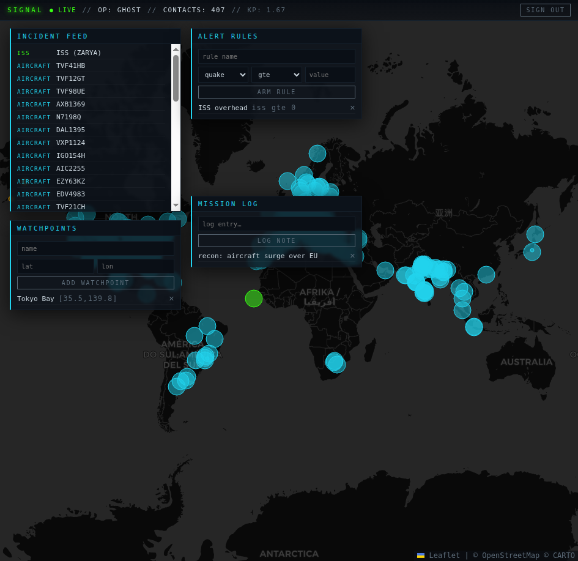
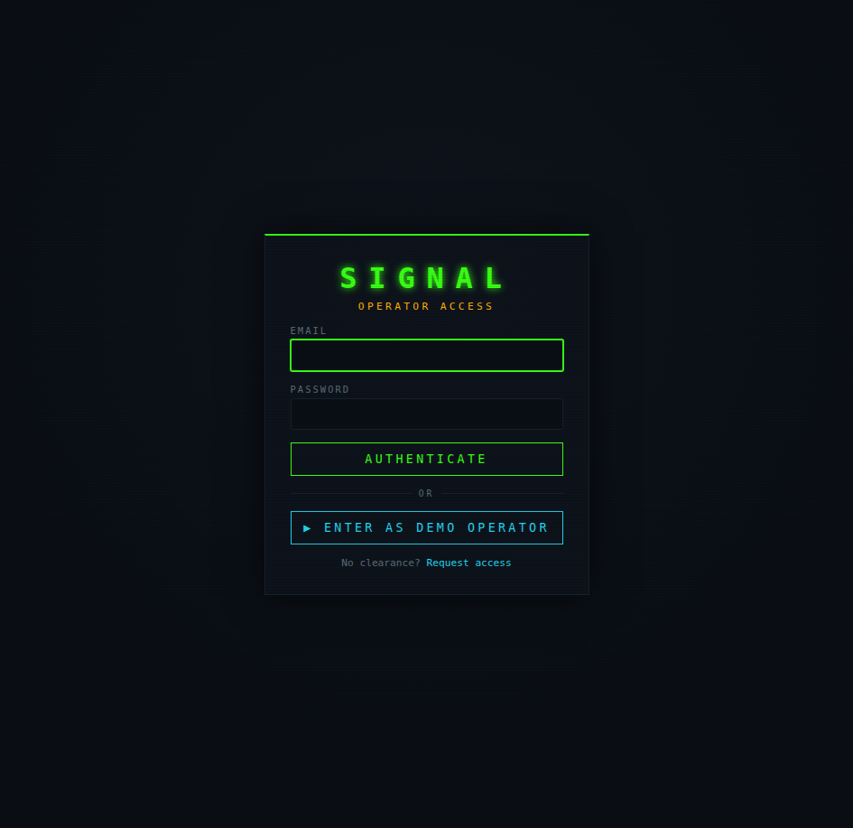
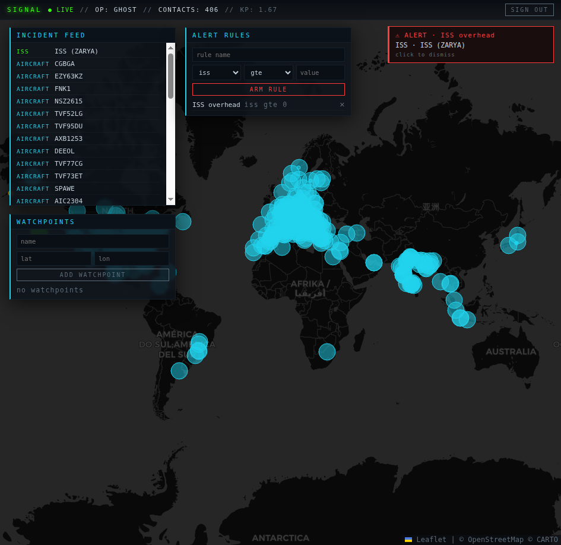
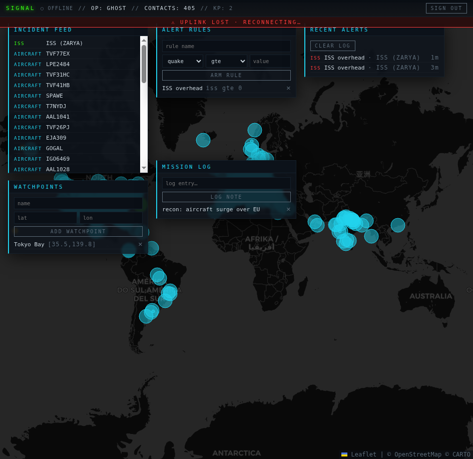

# SIGNAL — Tactical Command-Center Dashboard

A real-time **MERN + Socket.io** command console that aggregates live, public data feeds — earthquakes, aircraft, the ISS, space weather, and weather — onto a dark tactical world-map HUD. Operators sign in, drop **watchpoints**, log **mission notes**, and arm **alert rules** that fire live as matching events stream in.

Built to run end-to-end on **free tiers ($0 to deploy)**.



---

## Features

- 🛰️ **Live data fusion** — 5 key-less public APIs normalized into one event stream, rendered on a dark Leaflet map (markers colored by source, sized by magnitude).
- 🔐 **Auth** — JWT register/login, plus a **one-click demo operator** for instant access.
- 📍 **Watchpoints / Mission Log / Alert Rules** — full per-user CRUD.
- ⚡ **Real-time** — Socket.io streams feed deltas; armed alert rules fire toasts the moment a matching event arrives (with an optional geofence around a watchpoint).
- 🗂️ **Persistent alert history** — recent alerts survive a page refresh.
- 📡 **Resilient** — offline banner + last-known data retained if the uplink drops; dead upstreams fall back gracefully without crashing the API.

| Login | Alert firing | Uplink lost |
|---|---|---|
|  |  |  |

---

## Tech stack

**Frontend:** React (Vite), React-Leaflet, Zustand, Socket.io-client, React Router
**Backend:** Node, Express, Socket.io, Mongoose
**Database:** MongoDB Atlas
**Hosting (target):** Vercel (client) · Render (API) · MongoDB Atlas — all free tier

### Data sources (all free, no API key)
| Source | Provides |
|--------|----------|
| USGS | Earthquakes |
| OpenSky Network | Live aircraft positions |
| wheretheiss.at | ISS position |
| NOAA SWPC | Planetary Kp / space weather |
| Open-Meteo | Weather at a point |

---

## Architecture

```
client/  React HUD ── REST (seed) ──▶  Express API ──▶  MongoDB Atlas
   │                                      │
   └────────── Socket.io ◀───────────────┘   feed:update + alert:hit
                                          │
                              feed aggregator (polls 5 public APIs,
                              normalizes to one SignalEvent schema,
                              caches in-memory, evaluates alert rules)
```

The normalized event schema and every route/socket event are documented in [`server/API.md`](server/API.md) — the single source of truth for cross-boundary shapes.

---

## Run it locally

**Prerequisites:** Node 20+, a free [MongoDB Atlas](https://www.mongodb.com/atlas) cluster.

```bash
# 1. install everything (root + server + client)
npm run install:all

# 2. configure the server
cp server/.env.example server/.env
#   then set MONGODB_URI (your Atlas string) and a JWT_SECRET

# 3. run both server + client
npm run dev
```

- Client: http://localhost:5173
- API: http://localhost:4000

Click **“Enter as Demo Operator”** to skip registration.

### Environment

`server/.env`
```
PORT=4000
MONGODB_URI=<your atlas connection string>
JWT_SECRET=<any long random string>
CLIENT_ORIGIN=http://localhost:5173
```

`client/.env` (production only — dev uses the Vite proxy)
```
VITE_API_URL=<deployed API origin>
```

---

## Notes

- OpenSky’s anonymous API is rate-limited; aircraft data is cached and falls back to a sample set if throttled.
- The demo account is shared across visitors (frictionless try-before-register).

## License

MIT
